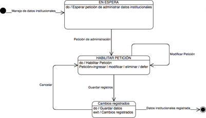
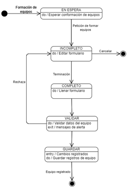

# Strategic Planning and Project Management System

## Index

1. [Problem Definition](#problem-definition)
2. [Objectives](#objectives)
3. [Project Scope](#project-scope)
4. [Available Resources](#available-resources)
5. [Feasibility Study](#feasibility-study)
6. [Development Process Model](#development-process-model)

---

## 1. Problem Definition

The issue identified is the absence of software to manage Strategic Planning and Project Management via Annual Operational Planning (POA), which entails the need to automate processes. The development will include the following subsystems for the Strategic Planning and Project Management System (POA):

### Institutional Definition Subsystem
- **Institutional Module**  
  - Company data  
  - Geographical Location and Area of Influence  
  - Service Offering
- **Institutional Philosophy Module**  
  - Management Team  
  - Execution Team  
  - Institutional Values  
  - Mission  
  - Vision  
  - Identification of strategic issues

### SWOT Analysis Subsystem
- **Internal and External Analysis Module**  
  - Strategic Theme  
  - Approach to the SWOT Matrix  
  - Internal Analysis  
  - External Analysis  
  - Strategic Objectives
- **Objectives and Strategies Module**  
  - Analysis of Strategic Objectives  
  - Strategies  
  - Indicators

### Annual Operational Planning (POA) Subsystem
- **Activities Module**  
  - Assignment of Activities  
  - Resource Allocation  
  - Assignment of Responsible Persons and Deadlines  

The implementation of the subsystems will allow users to gain several benefits:
- Centralized, coherent information without redundancies and accessible from anywhere via a web-based tool.
- Adequate management of financial, material, and human resources.
- Real-time information updates.
- An easy-to-use interface for process management.

The application will work in a web environment, integrating the company’s planning and project management areas.

---

## 2. Objectives

### General Objective:
Optimize strategic planning, project management (POA), and internal communication to ensure teams align with strategic objectives and organizational values.

### Specific Objectives:
- Improve the use of project management tools like Asana.
- Strengthen coordination between teams through collaboration tools like Slack.
- Align team efforts with the company's values through activities that reinforce the organizational culture.
- Develop a software system for strategic planning and project management (POA).

### Indicators of Success:
- Increased adoption of Asana.
- Reduction in manual planning methods.
- Improved resource management and project traceability.
- Enhanced communication and collaboration across teams.

---

## 3. Project Scope

### Included:
- System Modeling for strategic planning and project management.
- Feasibility analysis (technical and economic).
- Requirements documentation.
- System architecture design.
- Database design.
- User interface design.
- Process design.

### Excluded:
- System development.
- System testing and validation.
- Maintenance and support.
- Integration with other systems.

---

## 4. Available Resources

### Intangible Resources:
- **Technologies:**  
  - Platform: Windows Server  
  - Database: MySQL Server  
  - Programming Language: Python  
  - Framework: Flask  
  - IDE: Vs Code  
  - Server: Gunicorn

### Tangible Resources:
- Personnel: Project Leader, Programming Advisor, Strategic Planning Advisor, Analyst, Developer, Tester.

---

## 5. Feasibility Study

### Economic Feasibility:
Requires investment in software, hardware, and personnel, which will be covered by the company.

### Operational Feasibility:
The project will streamline processes, save resources, and ensure 24/7 information availability.

### Technical Feasibility:
The project will use accessible technologies, including free distribution tools.

---

## 6. Development Process Model

This project will use the **Scrum** methodology, featuring:
- Short Iterations (Sprints)
- Adding new modules
- Team collaboration
- Review and feedback
- Adaptability to changes

---

# DEVELOPMENT PROCESS MODEL

The execution of this project will follow the Agile Scrum methodology. Below are the key features of using Scrum in this project:

- **Short Iterations (Sprints):** The project will be divided into short cycles called sprints. Each sprint includes planning, development, review, and retrospective, allowing functional software increments to be delivered regularly.
- **Addition of New Modules:** At the end of each sprint, new modules or functionalities can be added to the system based on the user's priorities and needs, ensuring the software remains adaptable and continuously improvable.
- **Teamwork:** The software development and project management teams collaborate, assigning tasks equitably while leveraging the skills of each team member.
- **Review and Feedback:** At the end of each sprint, completed work is reviewed, and feedback is obtained from both the user and the team. This allows for continuous adjustments and improvements to the project.

## SCRUM TEAM

### Product Owner
The Product Owner represents the stakeholders, who are typically clients. To ensure that the Scrum Team always delivers value to the stakeholders and the business, the Product Owner defines product expectations, records product changes, and manages a Scrum backlog (a detailed and constantly updated task list for the Scrum project). They are also responsible for prioritizing the objectives of each sprint, ensuring that the most important features and deliverables are built during each iteration.

### Scrum Master
The Scrum Master leads the team to ensure they fully understand the Scrum methodology, adhere to its rules, and follow the processes effectively. They handle mentoring, coaching, training, facilitate meetings and events when necessary, and convey the overall project vision to the team. Additionally, they work alongside the Product Owner to maximize ROI.

The Scrum Master’s role can be summarized in two main tasks:
- **Managing the Scrum Process:** Responsible for ensuring the correct application of the methodology and facilitating the entire process. They ensure that Scrum generates value for the organization.
- **Removing Impediments:** The Scrum Master helps remove obstacles that may arise. They communicate the benefits of Scrum to the company, facilitating its implementation.

### Scrum Team
This is a self-organized group of 3 to 9 people with the commercial, design, analytical, and development skills to carry out the actual work, solve problems, and produce deliverable products. The Scrum Team members manage their tasks and are collectively responsible for meeting the goals of each sprint.

### Auxiliary Roles
Auxiliary roles include other stakeholders involved but not directly assigned to the Scrum project. These usually include clients, managers, and executive team members who consult, report progress, and gather feedback to work better and deliver maximum value.

### Stakeholders
Stakeholders are all individuals or organizations that have a direct or indirect relationship with the project and may be positively or negatively impacted at any time. They can be divided into two main groups:

- **Primary Stakeholders:** These have a direct relationship with the company and affect its processes. They may include customers, suppliers, shareholders, corporate partners, or employees.
- **Secondary Stakeholders:** These have an indirect connection with the company and do not affect its processes but can still be impacted by the company’s actions. This group includes media, competitors, governments, financial institutions, or the community.

## ROLE ASSIGNMENT
As defined in week 2, the human capital resource will assign the roles:

| Name                      | Role               |
| -------------------------- | ------------------ |
| CEO of the company          | Client             |
| Eng. Jessica Moreno         | Scrum Master       |
| Eng. Eleno Cruz             | Product Owner      |
| Stakeholders                |                    |
| M.I. Juan Carlos González   | Scrum Team         |
| Jr. Sergio Cruz             | Scrum Team         |
| Eng. Alejandro Reyes        | Scrum Team         |

## USER REQUIREMENTS
The users of the system will include all members involved in SW project management and development within the company. The system must be concrete and reliable, automating strategic planning and project management processes, offering features like:

- Easy to use, intuitive, and user-friendly interface requiring minimal instructions.
- Secure access.
- Personalized use.
- Access to information on all company projects.
- Remote access from various locations outside the workplace.
- Flexibility in reorganizing management and execution teams.
- Record of ongoing and completed projects.
- Records of project managers and submitted information.
- Configurable team size for management or execution.
- Ability to modify information.
- Standardized document generation formats.
- Fast technical support.
- Periodic activity compliance logging with relevant information.

These features ensure that users can better optimize economic and human resources used in strategic planning and project management.

## FUNCTIONAL REQUIREMENTS ANALYSIS

### ACTORS

#### Working Team
1. **Software Development Team:** Responsible for creating, testing, and maintaining software applications and systems, comprising several key roles.
2. **Project Management Team:** Responsible for planning, executing, and closing projects, ensuring they are completed on time, within budget, and with the expected quality.

### Types of Actors
- **System Administrator:** Manages the strategic planning and project management system.
- **System Users:** Any person interacting with a system or application. Depending on the system, users may have different roles and access levels.

### Roles

#### Working Team
1. **Software Development Team**
   - Project Leader
     - Programming Advisor
     - Strategic Planning Advisor
     - Analyst and Developer
     - Software Validation Staff (Tester)
   
2. **Project Management Team**
   - Project Administrator
     - Project Team Members

## USER STORIES (ROLE REQUIREMENTS)

User stories are brief, simple descriptions of a functionality or feature from the end user's perspective, commonly used in Agile Scrum to capture system requirements.

- As an **administrator**, I want to manage the company's data to ensure the information is updated and accurate.
- As an **administrator**, I want to establish clients, mission, vision, values, and strategic themes to define and communicate the institution's strategic direction.
- As an **administrator**, I want to form execution teams to assign and organize the necessary human resources for strategic projects.
- As an **administrator**, I want to review the execution of strategic themes to ensure projects are progressing as planned.
- As a **system user**, I want permission to execute a Strategic Theme to carry out assigned tasks within the project.
- As a **system user**, I want my personal data (payroll number, first name, last name, address, phone number, username, and password) to be stored securely without null values to ensure the integrity and security of my information.
- As a **system user**, I want my username to be unique to avoid confusion and ensure account individuality.
- As a **system user**, I want all activities I perform in the system to log my identity to maintain a clear and accurate record of actions.

## INSTITUTIONAL DEFINITION SUBSYSTEM REQUIREMENTS

- **Institutional Module**
  - As an **administrator**, I want to input and update information on clients or companies receiving SW development services, such as name, address, phone number, creation date, service type, geographic location, and zone of influence to keep information updated and accurate.
  - As an **administrator**, I want to generate a report with descriptive company data and ongoing projects to have a comprehensive view of the organization, planning, and project management.

- **Institutional Philosophy Module**
  - As an **administrator**, I want to input SW development team member data, such as payroll number, name, last name, address, phone number, role, username, and password to maintain a complete and detailed staff record.
  - As an **administrator**, I want to update and delete SW development team data to ensure personnel information is always up to date and accurate.
  - As an **administrator**, I want to assign members to the management or SW development team to organize and distribute human resources effectively.
  - As an **administrator**, I want to modify the members of the management or SW development team to adapt to changes in the team structure.
  - As an **administrator**, I want to assign, update, and delete Strategic Themes to management or SW development teams to manage and direct strategic projects effectively.
  - As an **administrator**, I want to register, update, and delete company values to reflect the company's principles and values.
  - As an **administrator**, I want to register and update the company's mission and vision to clearly communicate the company’s objectives and purposes.
  - As an **administrator**, I want to register, update, and delete strategic themes to keep strategic planning aligned with company objectives.
  - As an **administrator**, I want to generate member reports to have a detailed staff record.
  - As an **administrator**, I want to generate reports on management or SW development team members with their respective roles to have a clear view of the team structure.
  - As an **administrator**, I want to generate reports on Strategic Themes and their management teams to monitor and evaluate the progress of strategic projects.
  - As an **administrator**, I want to generate reports on the company’s mission, vision, and values to ensure all members are aligned with the institutional objectives and principles.

## PRODUCT BACKLOG (Summary)

| **ID**  | **Actor**            | **Description**                                                                                                                                                      | **Estimation (Story Points)** | **Priority** |
|---------|----------------------|--------------------------------------------------------------------------------------------------------------------------------------------------------------------|-------------------------------|--------------|
| HS-1    | Administrator         | As an Administrator, I want to manage company data to ensure the information is up-to-date and accurate.                                                            | 5                             | High         |
| HS-2    | Administrator         | As an Administrator, I want to establish clients, mission, vision, values, and strategic themes to define and communicate the strategic direction.                 | 8                             | High         |
| HS-3    | Administrator         | As an Administrator, I want to form execution teams to assign and organize the necessary human resources for strategic projects.                                    | 8                             | High         |
| HS-4    | Administrator         | As an Administrator, I want to review the execution of strategic themes to ensure projects are carried out as planned.                                              | 5                             | High         |
| HS-5    | System User           | As a System User, I want permission to execute a Strategic Theme to carry out the tasks assigned within the project.                                                | 3                             | Medium       |
| HS-6    | System User           | As a System User, I want my personal data to be stored securely and without null values to ensure its integrity.                                                    | 5                             | High         |
| HS-7    | System User           | As a System User, I want my username to be unique to avoid confusion and ensure the individuality of my account.                                                    | 3                             | High         |
| HS-8    | System User           | As a User, I want all activities I perform in the system to log my identity to maintain a clear and accurate history of actions taken.                              | 3                             | Medium       |
| HS-9    | Administrator         | As an Administrator, I want to enter and update information about clients/companies to keep the information up-to-date.                                            | 5                             | High         |
| HS-10   | Administrator         | As an Administrator, I want to generate a report of the company’s descriptive data and projects to have an overall view.                                           | 5                             | Medium       |
| HS-11   | Administrator         | As an Administrator, I want to enter data about team members to maintain a complete record of staff.                                                               | 5                             | High         |
| HS-12   | Administrator         | As an Administrator, I want to update and delete software development team data to ensure personnel information is accurate.                                        | 3                             | Medium       |
| HS-13   | Administrator         | As an Administrator, I want to assign members to management and development teams to organize human resources properly.                                             | 5                             | High         |
| HS-14   | Administrator         | As an Administrator, I want to modify team members to adapt to changes in team structure.                                                                          | 3                             | Medium       |
| HS-15   | Administrator         | As an Administrator, I want to manage Strategic Themes to direct strategic projects effectively.                                                                  | 8                             | High         |
| HS-16   | Administrator         | As an Administrator, I want to record, update, and delete company values to reflect the company’s principles.                                                      | 5                             | Medium       |
| HS-17   | Administrator         | As an Administrator, I want to record and update the mission and vision to clearly communicate the company’s objectives.                                           | 5                             | High         |
| HS-18   | Administrator         | As an Administrator, I want to generate reports of Strategic Themes to monitor and evaluate project progress.                                                      | 5                             | High         |
| HS-19   | System User           | As a team member, I want to manage SWOT analysis of Strategic Themes to keep an accurate and up-to-date analysis.                                                  | 8                             | High         |
| HS-20   | Administrator         | As an Administrator, I want to generate reports of the SWOT matrix to evaluate the analyses conducted.                                                             | 5                             | Medium       |
| HS-21   | System User           | As a team member, I want to manage POA activities to monitor progress toward strategic objectives.                                                                | 8                             | High         |
| HS-22   | Administrator         | As an Administrator, I want to create a detailed POA report to have a complete view of operational progress and planning.                                          | 8                             | High         |

## Sample model
Design phase activities within a development cycle

## Uses Cases

Use Case	                                                ID
Automate processes	                                    CU-1
Maintain Information	                                CU-2
Maintain System User	                                CU-3
Maintain Business Philosophy	                        CU-4
Maintain Values	                                        CU-5
Manage Work Teams	                                    CU-6
Assign strategic theme to team	                        CU-7
Maintain SWOT	                                        CU-8
Maintain Strategies	                                    CU-9
Maintain Strategic Objectives	                        CU-10
Maintain Indicators by Strategic Objectives	            CU-11
Administer POA.	                                        CU-12
Add User	                                            CU-13
Sign in	                                                CU-14

## State Diagrams

Company Data Processing Model

System User Registration Process Model

Team Building Process Model

SWOT Matrix Process Model

Process model of Internal and External Analysis of the SWOT matrix.

Process model for the management of the POA (Annual Operational Planning).

Project Search Model

## Sequence Diagrams

Company Data Processing

System User Maintenance Process

Team Building Process

Mission and Vision maintenance process

Internal and External Analysis Process Model

POA maintenance process

## Component Diagram

### Flask Python: Framework
This component is the core of the system, based on the Flask framework, which is used to develop web applications in Python. Flask acts as the underlying framework that supports the operation of the modules.

### Core Modules
The modules are connected to the Flask component, indicating that they are part of the web application. These are:
    - Institutional: This module is responsible for the management of data related to the institutional part of the system. It could include data such as organizational structure, policies, and other institutional aspects.

    - Institutional Philosophy: This component is related to the management of the mission, vision and values of the institution or company. It is key to defining the strategic and cultural direction of the organization.

    -Internal and External Analysis: This module manages the analysis of the organization, both internally (e.g., strengths and weaknesses) and externally (e.g., opportunities and threats). It could be related to SWOT analysis.

### Objectives and Strategies: Here the strategic objectives of the organization and the strategies to be followed to achieve them are managed. This module is important for long-term planning.

### Annual Operational Planning: This module appears to be related to Internal and External Analysis, indicating that it relies on the results of the analysis to develop operational plans. Annual operational planning manages the concrete plans and goals for each fiscal year, based on the defined analyses and strategies.

## Class Diagram

### Class Diagram Data Dictionary

- Flask_Python_Framework Main framework that supports the application and connects the modules with the database and business logic.	               - Framework
- AutomateProcesses	In charge of maintaining and managing information related to institutional processes, assignment of strategic issues and teams.	   - Entity
- Consultations	It provides database queries to obtain information about users, strategies, POAs, among others.	                                       - Entity
- Eliminate	Perform delete operations on the database, such as deleting users, strategies, POAs, etc.	                                               - Entity
- ConnectionDB	It handles connections to the database, with plug-and-break functions.	                                                               - Entity
- Strategy	Records information on the strategies proposed by the institution.	                                                                       - Entity
- Strategic Objective	Records and validates the strategic objectives of the institution.	                                                           - Entity
- Offer	Records the educational or service offer of the institution.	                                                                               - Entity
- Swot	Records information from the SWOT analysis (strengths, weaknesses, opportunities, and threats).	                                               - Entity
- Poa	Monitors the Annual Operating Plan (AOP).	                                                                                                   - Entity
- Institutional Value	Records and validates institutional values.	Entity
- User	It contains the information of the users of the system (name, address, date of registration, among others).	                                   - Entity
- CompanyCustomer	It records the information of the client companies (name, mission, vision, type of service, among others).	                       - Entity
- CompanySupplier	It contains the information of the provider companies (name, type of service, values, date of creation, among others).	           - Entity
- Strategic Theme	It records the different strategic issues that are studied for the planning of the institution.	                                   - Entity
- Income	Performs the management of information records in the database (users, SWOT, strategies, etc.).	                                               - Entity

## Database model

| Entity                          | Description                                                                                      | Related to                                             |
|---------------------------------|--------------------------------------------------------------------------------------------------|-------------------------------------------------------|
| User Table                      | It contains information about users in the system, with fields for user type (Usuario_tipo_enum) and role (Usuario_rol_enum). | Datos_Personales, Credentials, Team, TeamMember, ActivityHistory, among others |
| Table Datos_Personales          | It relates users' personal data (names, surnames, address, telephone number, etc.).            | User (id_usuario)                                     |
| Credentials Table               | It stores the access credentials of each user (username and password).                         | User (id_usuario)                                     |
| Supplier-Company Table          | It contains information about the supplier companies (name, address, telephone number, etc.).  | MissionVisionValues, Strategic Theme                  |
| CompanyCustomer Table           | Define the details of the client companies (name, address, main contact, sector, etc.).       | Management (equipo_gestion_id), Development (equipo_desarrollo_id) |
| MissionVisionValues Table       | It contains the mission, vision and values of a supplier company.                               | CompanySupplier                                        |
| Strategic Topic Table           | It defines the strategic issues for the supplier companies and their manager.                   | CompanySupplier, Equipment, SWOT                       |
| Team Table                      | It defines the teams that manage or develop projects, with fields such as the team name, the type of team (management or development), and the associated strategic theme. | TeamMember, CompanyCustomer                            |
| Team Member Table               | It defines the members of a team and their roles.                                              | Team, User                                           |
| SWOT Table                      | Records SWOT (Strengths, Weaknesses, Opportunities, Threats) analyses associated with a strategic theme. | Strategic Theme, Strategy                              |
| Strategy Table                  | Define the strategies derived from the SWOT analysis.                                          | Swot                                                  |
| Strategic Objective Table       | Define strategic objectives for a particular topic, with indicators of success.                 | Strategic Theme, Activity, POA                        |
| Activity Table                  | Store activities linked to a strategic objective, with fields of description, date of completion, percentage of progress and budget. | Strategic Objective                                    |
| POA Table                      | It stores the Annual Operating Plan, with indicators and goals related to the strategic objectives. | Strategic Objective                                    |
| Activity History Table          | Records the history of actions performed by users, such as system auditing.                     | User                                                  |

# Conclusions

Requirements analysis and system modeling using UML modeling allow you to structure an efficient solution that addresses Fyware's needs. The use of UML diagrams has been essential to model the proposed solution for Fyware. Each type of diagram is important in understanding, designing, and communicating the key elements of the system. This approach ensures that the proposed platform not only optimizes project management but also improves strategic alignment with business objectives, providing a customized solution for the VR software development sector.

The implementation of the Scrum methodology in Fyware turns out to be an effective solution to address the problem of Strategic Planning and Project Management in the field of software development. Scrum, as an agile methodology, allows the functional requirements of the system to be managed in an iterative and flexible way, ensuring that the final product is aligned with both the needs of the users and the strategic objectives of the company.

Functional requirements are obtained and refined through constant collaboration between the different actors involved in the project, such as product owners, scrum masters, and developers. In the context of Fyware, product owners represent managers and administrators, who have a clear vision and goals for the project planning and management platform.

- **Product Owner:** Represents Fyware's project and administration managers, in charge of defining requirements and prioritizing the backlog.
- **Scrum Master:** Facilitates the Scrum process, removing obstacles and making sure that the development team can work without interruptions.
- **Development Team:** Fyware's software developers, who work on the creation and implementation of the project planning and management platform.

Through the creation of the product backlog, key functionalities such as resource allocation, project progress visualization, and strategic process automation are prioritized. They provide Fyware with a solid framework to develop a strategic planning and project management platform tailored to its specific needs in the field of augmented and virtual reality software development. 

# References

1. Ango, L. F. (2014). ANGO HERRERA, Luis Fernando. “Evaluación de Sistemas”, Tesis, Ibarra, Pontifica Universidad Católica del Ecuador.
2. Bautista, L. (2012). Modelos de Software", Tesis: Control de Calidad de software, Perú, Ica.
3. Durán, F. V. (2010). INTRODUCIENDO PSP (PROCESOS PERSONAL DE SOFTWARE) EN EL AULA. En: Revista Colombiana de Tecnologías de Avanzada, 16.
4. Hassani-Alaoui, S., Cameron, A. F., & Giannelia, T. (2020). “We use scrum, but…”: Agile modifications and project success. Engineering Science & Technology Journal, 5(4), 1357-1371.
5. Holguín, J. (2015). Definición de un proceso de desarrollo de software con control de calidad del producto en una empresa pyme de la región. Tesis de Maestría en Gestión y Desarrollo de Proyectos de Software. Manizales - Colombia: Universidad. Colombia.
6. Ibeh, C. V., Awonuga, K. F., Okoli, U. I., Ike, C. U., Ndubuisi, N. L., & Obaigbena, A. (2024). A review of agile methodologies in product lifecycle management: bridging theory and practice for enhanced digital technology integration. Engineering Science & Technology Journal, 5(2), 448-459.
7. Ionos. (26 de octubre de 2018). Digitalguide. Obtenido de https://www.ionos.es/digitalguide/paginas-web/desarrollo-web/uml-lenguaje-unificado-de-modelado-orientado-a-objetos/
8. Kadenic, M. D., Koumaditis, K., & Junker-Jensen, L. (2023). Mastering scrum with a focus on team maturity and key components of scrum. Information and Software Technology, 153, 107079.
9. Lucidchart. (2017). Qué es el lenguaje unificado de modelado (UML). Obtenido de https://www.lucidchart.com/pages/es/que-es-el-lenguaje-unificado-de-modelado-uml
10. Maida, E. (2017). Obtenido de https://repositorio.uca.edu.ar/bitstream/123456789/522/1/metodologias-desarrollo-software.pdf
11. Microsoft. (24 de septiembre de 2019). Obtenido de https://www.microsoft.com/es-ww/microsoft-365/business-insights-ideas/resources/guide-to-uml-diagramming-and-database-modeling
12. Moszkowitz. (1999-2010). Modelos de excelencia en la gestión. Uruguay: ISSN 1510-4214.
13. Nuti, V. (2023). Analysis of the effectiveness of the Scrum approach in the management of an IT project (Doctoral dissertation, Politecnico di Torino).
14. Pressman, R. (2010). Ingeniería del Software. Un enfoque práctico (7ma ed.). España: McGraw-Hill Interamericana.
15. Sambrano Aguilar, F. A. B. I. A. N. (2021). Agile scrum survey at pago PA project: challenges and opportunities.
16. Sommerville, I. (2011). Arquitectura de software. Madrid.
17. Soto, D. (2015). INTRODUCIENDO PSP (PROCESOS PERSONAL DE SOFTWARE). Revista Colombiana de Tecnologías de Avanzada, 16, 1-5.
